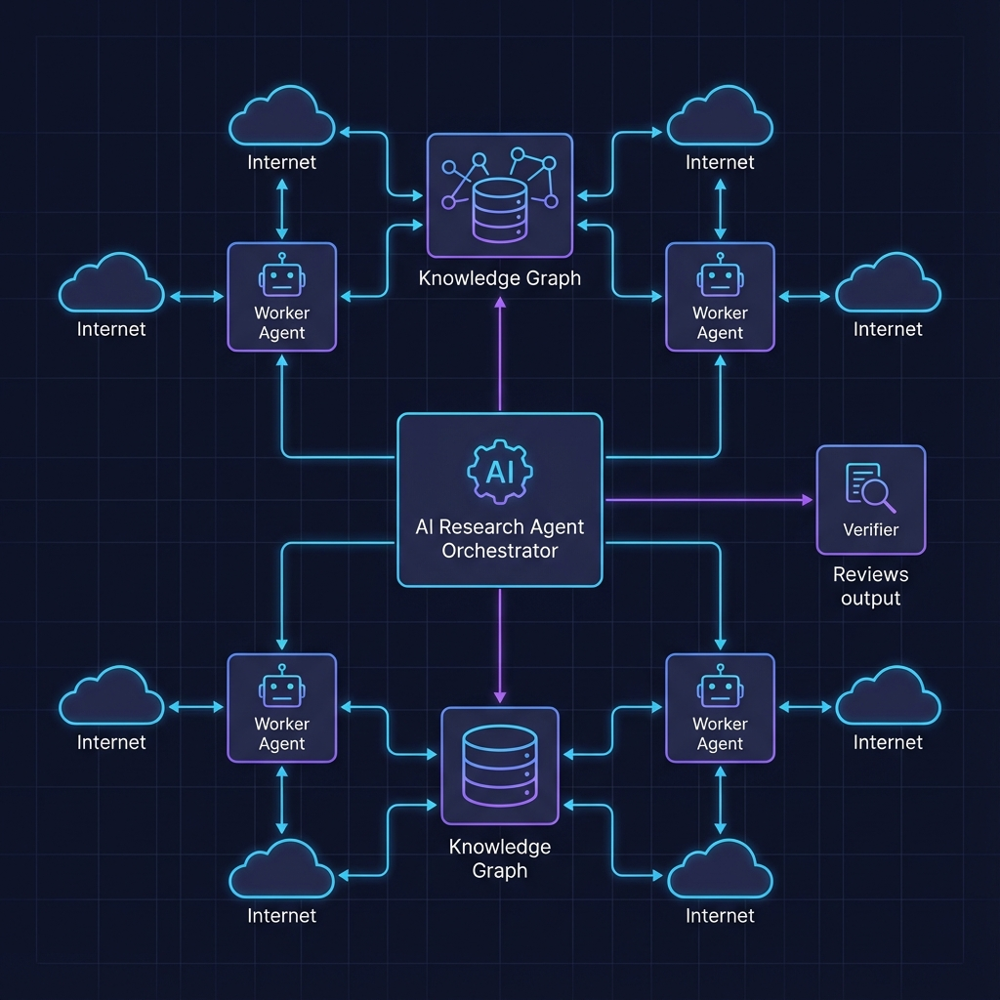

# System Architecture

## Overview
The Research Agent is a **multi-agent system** designed for deep, iterative research. It combines graph-based memory, parallel web search, and reflective planning to produce high-quality, comprehensive reports.

## High-Level Components

### 1. Interface Layer
- **CLI (`main.py`)**: Entry point for running research queries.
- **LangSmith**: Observability platform for tracing agent thought processes and debugging.

### 2. Cognitive Layer (The Brain)
- **LangGraph**: The state machine orchestration engine.
- **LLM**: GPT-4o (or similar high-reasoning model) used for planning, extracting, and synthesizing.

### 3. Memory Layer
- **GraphRAG**: NetworkX + HippoRAG algorithm for associative retrieval.
- **Vector Store**: ChromaDB for semantic search.
- **Short-Term Context**: LangGraph `State` passed between nodes.

### 4. Tool Layer
- **Tavily API**: For high-quality web search results.
- **arXiv API**: For academic paper search (free, no API key required).
- **Semantic Scholar API**: Optional academic paper search (requires API key).
- **Docker Sandbox**: Secure environment for executing Python code generated by the agent (for plotting or data analysis).

## Data Flow

1.  **Input**: User sends a query (e.g., "State of the art in LLM alignment").
2.  **Planning**: `LeadResearcher` interacts with `GraphRAG` to see what is already known.
3.  **Execution**: `Subagents` are spawned to fill knowledge gaps via parallel Web and Paper Search.
   - Web search (Tavily) for current information and general content
   - Paper search (arXiv/Semantic Scholar) for academic research
   - LLM intelligently selects which sources to use based on task requirements
4.  **Ingestion**: New findings are fed back into the `GraphRAG`, creating new nodes and edges.
5.  **Synthesis**: Results are aggregated and verified.
6.  **Output**: A final markdown report with citations from all source types.

## Directory Structure

- `graph/`: LangGraph definitions (nodes, edges, workflow).
- `memory/`: GraphRAG, VectorStore, and retrieval logic.
- `nodes/`: Individual agent logic (researcher, synthesizer, verifier).
  - `nodes/subagent/`: Subagent subgraph implementation (see [SUBAGENT_DESIGN.md](./SUBAGENT_DESIGN.md))
  - `nodes/synthesizer.py`: Sophisticated synthesis engine (see [SYNTHESIZER_DESIGN.md](./SYNTHESIZER_DESIGN.md))
- `tools/`: Interfaces for Search, Code Execution, etc.

## Related Documentation

- **[SUBAGENT_DESIGN.md](./SUBAGENT_DESIGN.md)**: Comprehensive documentation of the subagent subgraph architecture, including state isolation, routing logic, error handling, and advanced features.
- **[SYNTHESIZER_DESIGN.md](./SYNTHESIZER_DESIGN.md)**: Detailed documentation of the synthesizer's sophisticated design, including SCR framework, incremental synthesis, early decision optimization, semantic memory retrieval, and multi-pass refinement.
- **[WORKFLOW_DESIGN.md](./WORKFLOW_DESIGN.md)**: Detailed workflow orchestration and parallelization strategy.
- **[WORKFLOW_FEEDBACK.md](./WORKFLOW_FEEDBACK.md)**: Comprehensive documentation of feedback loops and reverse information flow, including how Decision node feedback guides Lead Researcher and Synthesizer refinement.
- **[MEMORY.md](./MEMORY.md)**: Memory system architecture and GraphRAG implementation.
