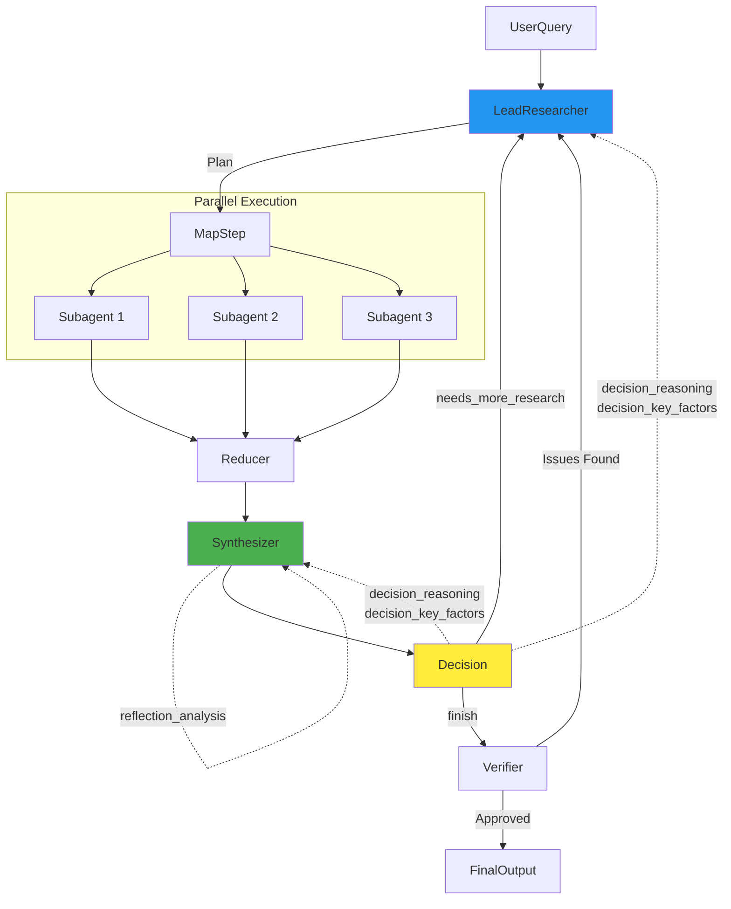

# Workflow Design & Orchestration

The Research Agent uses a **Hierarchical Orchestrator-Worker Pattern** implemented with `LangGraph` to manage complex, multi-step research tasks.

## 1. Orchestrator-Worker Architecture

### The Manager ("Lead Researcher" Node)
The **Lead Researcher** is the central brain. It does not perform research itself; instead, it manages the process.

- **Responsibilities**:
    1.  **Decomposition**: Breaks down the user's high-level query into specific, actionable sub-questions.
    2.  **Delegation**: Assigns these sub-questions to worker nodes ("Subagents").
    3.  **Synthesis**: Reads the reports from workers and synthesizes a master answer.
    4.  **Reflection**: Decides if the synthesized answer is sufficient or if more research loops are needed.

### The Workers ("Subagent" Nodes)
Workers are specialized agents that execute a specific sub-task.

- **Capabilities**:
    - **Web Search**: Uses Tavily API to find external information.
    - **Academic Paper Search**: Searches arXiv (and optionally Semantic Scholar) for research papers.
    - **Parallel Search**: Performs web and paper searches simultaneously for comprehensive coverage.
    - **Intelligent Source Selection**: LLM decides which sources to use based on task requirements.
    - **Reading**: Scrapes and processes full webpage content.
    - **Reporting**: Returns a structured report with extracted citations from all source types.

> **📖 For detailed subagent design documentation, see [SUBAGENT_DESIGN.md](./SUBAGENT_DESIGN.md)**
> 
> The subagent system is a sophisticated subgraph with intelligent routing, context isolation, error handling, and advanced features like tool execution and reference enhancement.

## 2. Parallelization Strategy

We use `LangGraph`'s **Map-Reduce** capabilities to run subagents in parallel.

### The `Send` API
We utilize the `Send()` function (conditional edge) to dynamically spawn worker branches.

```python
# Pseudo-code logic in the graph
def route_subagents(state):
    # Map: Create a 'Send' object for each sub-query
    return [
        Send("subagent_node", {"query": q}) 
        for q in state.sub_queries
    ]
```

This allows the system to scale horizontally. If a query requires searching 5 different topics, 5 subagents run simultaneously, reducing end-to-end latency significantly compared to a sequential chain.

## 3. The Synthesis Engine

The `Synthesizer` node is a sophisticated component that transforms raw findings into comprehensive reports:

- **SCR Framework**: Uses Situation-Complication-Resolution structure for organized reporting
- **Incremental Updates**: Updates existing synthesis when new findings arrive (rather than regenerating)
- **Early Decision Optimization**: Can stop after Situation+Complication to save time when research continues
- **Semantic Memory Retrieval**: Uses LangMem to find relevant historical findings for each section
- **Two-Pass Refinement**: Performs reflection and refinement for first-time synthesis
- **Graph-Aware**: Maps knowledge graph structure to SCR sections (hubs → Situation, conflicts → Complication, paths → Resolution)

> **📖 For detailed synthesizer design documentation, see [SYNTHESIZER_DESIGN.md](./SYNTHESIZER_DESIGN.md)**
> 
> The synthesizer implements advanced techniques including chained generation, incremental updates, semantic retrieval, and multi-pass refinement to produce high-quality reports while optimizing for efficiency.

## 4. Feedback Loops & Reverse Information Flow

The workflow implements sophisticated **feedback mechanisms** where downstream nodes provide information back to upstream nodes:

### Decision → Lead Researcher Feedback

When the Decision node determines more research is needed, it provides structured feedback:

- **`decision_reasoning`**: Detailed explanation of why more research is needed
- **`decision_key_factors`**: Specific areas or topics that need more coverage

The Lead Researcher uses this feedback to generate **targeted tasks** in the next iteration, focusing on the identified gaps.

### Synthesizer Self-Refinement

The Synthesizer performs **reflection and refinement**:

- **Reflection**: Analyzes initial synthesis quality (depth, missing insights, logic issues)
- **Refinement**: Improves synthesis based on reflection feedback
- **Decision Integration**: Uses decision reasoning to refine synthesis when research continues

### State-Based Feedback Propagation

Feedback flows through the shared `ResearchState`:

- Decision outputs are stored in state fields
- Lead Researcher reads feedback from state in subsequent iterations
- Synthesizer uses both reflection and decision feedback for refinement
- State persistence ensures feedback survives across iterations

> **📖 For detailed feedback mechanism documentation, see [WORKFLOW_FEEDBACK.md](./WORKFLOW_FEEDBACK.md)**
> 
> The feedback system enables adaptive planning, quality improvement, and iterative refinement through structured reverse information flow.

## 5. The Verification Loop

To ensure quality, we implement a **Verifier-Synthesizer Loop**:

1.  **Synthesis**: The `Synthesizer` node aggregates all subagent reports.
2.  **Verification**: The `Verifier` node checks the synthesized report against the raw finding chunks.
    - *Hallucination Check*: Does the text claim X when the source supports Y?
3.  **Correction**: If high hallucination risk is detected, the report is sent back for re-synthesis with explicit feedback.

## Diagram



**Legend**:
- Solid arrows: Forward flow (normal execution)
- Dashed arrows: Feedback flow (reverse information flow)
