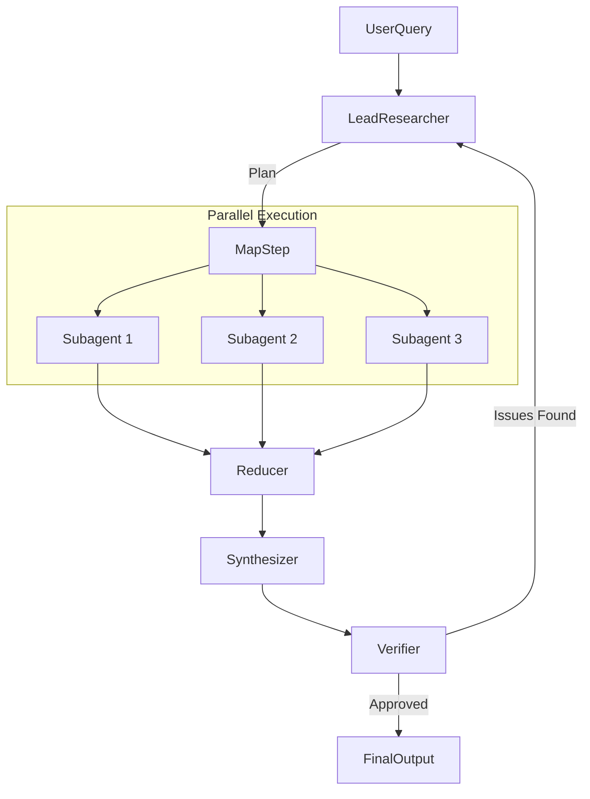

# Workflow Design & Orchestration

The Research Agent uses a **Hierarchical Orchestrator-Worker Pattern** implemented with `LangGraph` to manage complex, multi-step research tasks.

## 1. Orchestrator-Worker Architecture

### The Manager ("Lead Researcher" Node)
The **Lead Researcher** is the central brain. It does not perform research itself; instead, it manages the process.

- **Responsibilities**:
    1.  **Decomposition**: Breaks down the user's high-level query into specific, actionable sub-questions.
    2.  **Delegation**: Assigns these sub-questions to worker nodes ("Subagents").
    3.  **Synthesis**: Reads the reports from workers and synthesizes a master answer.
    4.  **Reflection**: Decides if the synthesized answer is sufficient or if more research loops are needed.

### The Workers ("Subagent" Nodes)
Workers are specialized agents that execute a specific sub-task.

- **Capabilities**:
    - **Web Search**: Uses Tavily API to find external information.
    - **Reading**: Scrapes and processes full webpage content.
    - **Reporting**: Returns a structured report with extracted citations.

## 2. Parallelization Strategy

We use `LangGraph`'s **Map-Reduce** capabilities to run subagents in parallel.

### The `Send` API
We utilize the `Send()` function (conditional edge) to dynamically spawn worker branches.

```python
# Pseudo-code logic in the graph
def route_subagents(state):
    # Map: Create a 'Send' object for each sub-query
    return [
        Send("subagent_node", {"query": q}) 
        for q in state.sub_queries
    ]
```

This allows the system to scale horizontally. If a query requires searching 5 different topics, 5 subagents run simultaneously, reducing end-to-end latency significantly compared to a sequential chain.

## 3. The Verification Loop

To ensure quality, we implement a **Verifier-Synthesizer Loop**:

1.  **Synthesis**: The `Synthesizer` node aggregates all subagent reports.
2.  **Verification**: The `Verifier` node checks the synthesized report against the raw finding chunks.
    - *Hallucination Check*: Does the text claim X when the source supports Y?
3.  **Correction**: If high hallucination risk is detected, the report is sent back for re-synthesis with explicit feedback.

## Diagram


